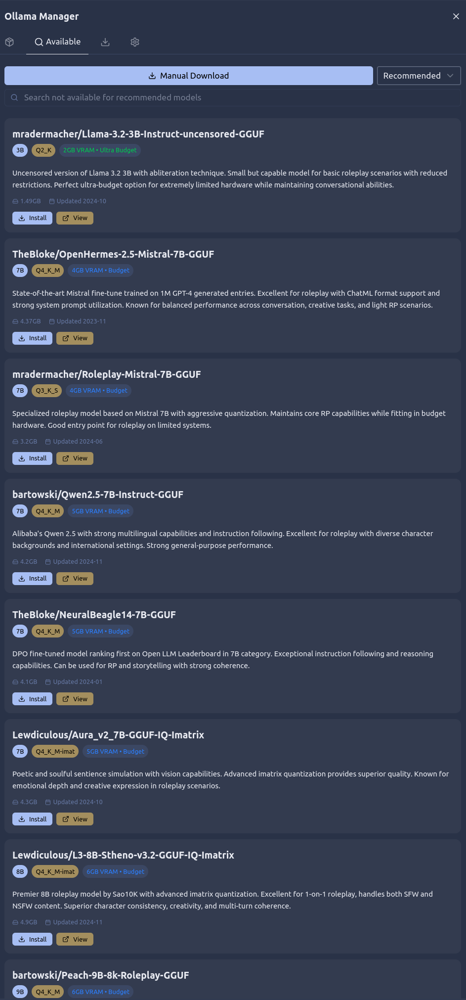
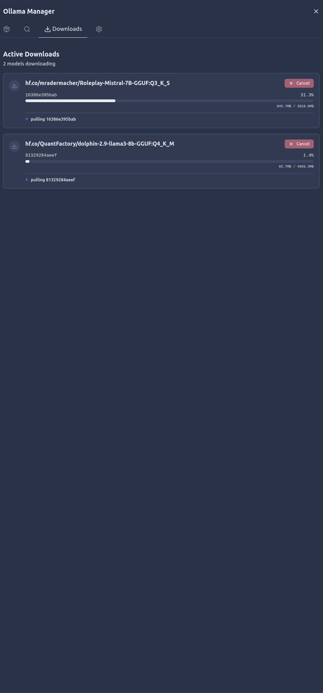
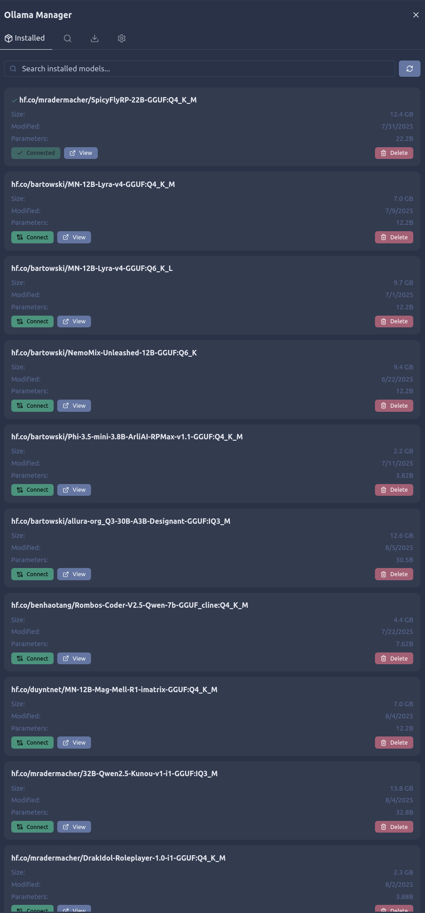
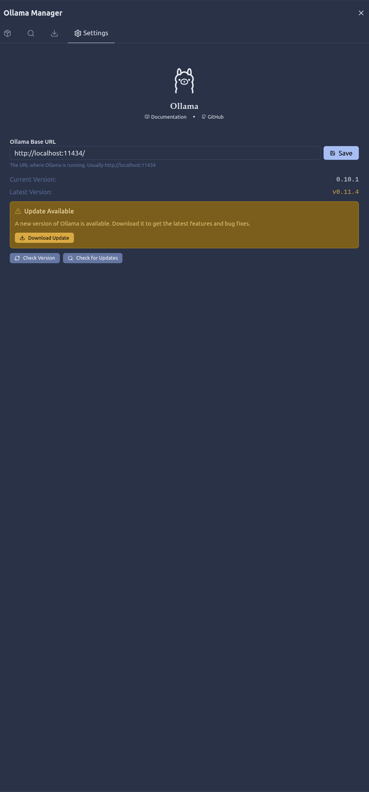

<p align="center">
  
</p>

> **⚠️ Serene Pub is in alpha! Expect bugs and rapid changes. This project is under heavy development.**

<p align="center">
  <b><a href="https://github.com/doolijb/serene-pub/wiki">📚 Documentation</a> •
  <a href="https://github.com/doolijb/serene-pub/releases">⬇️ Downloads</a> •
  <a href="https://github.com/doolijb/serene-pub/issues">🐛 Issues</a> •
  <a href="https://discord.gg/3kUx3MDcSa">💬 Discord</a> •
  <a href="https://buymeacoffee.com/serenepub">☕ Buy Me a Coffee</a></b>
</p>

---

# 🦊 Serene Pub

**Modern, Open Source AI Roleplay Chat**

Serene Pub is a brand new, open source chat application for immersive AI roleplay and creative conversations. Designed for simplicity, speed, and beautiful usability, Serene Pub brings your characters and worlds to life—on your terms, with your data, and your favorite AI models.

## 📚 **[Full Documentation & Setup Guide](https://github.com/doolijb/serene-pub/wiki)**

**For detailed installation instructions, configuration guides, and tutorials, visit our [Wiki](https://github.com/doolijb/serene-pub/wiki).**

---

## Table of Contents

- [Why Serene Pub?](#-why-serene-pub)
- [Screenshots](#-screenshots) 
- [Features](#-features)
- [Quick Start](#-quick-start)
- [Documentation](#-documentation)
- [Contributing](#-contributing)
- [License](#-license)

---

## ✨ Why Serene Pub?

- **Zero Clutter, Maximum Fun:** Clean, intuitive UI with minimal menus and instant access to everything you need.
- **Real-Time Sync:** All chats, settings, and characters update live across devices via WebSockets.
- **Portable & Private:** Runs locally, no accounts, no cloud lock-in. Your data stays with you.
- **AI Freedom:** Connect to OpenAI, Ollama, LM Studio, Llama.cpp, and more. Mix and match models, run local or cloud.
- **Low fuss local AI**: Use Ollama manager to search, download and activate models all within the comfort of Serene Pub.
- **Roleplay-First:** Built for character-driven, story-rich experiences. Import Silly Tavern cards, manage personas, and more.
- **Coherence:** Some user's report characters adhere better to their profiles than other apps.
- **Group Chats:** Chat with as many characters at once as you wish.
- **Mobile Ready:** Responsive design for desktop and mobile. Pick up your story anywhere.
- **Open Source:** AGPL-3.0. Hack it, extend it, make it yours!

---

## 🖼️ Screenshots

### Desktop Experience

| Chat & Editing                                | Connections & Characters                                   | Contexts & Lorebooks                                   |
| --------------------------------------------- | ---------------------------------------------------------- | ------------------------------------------------------ |
|  |  |  |

| Prompt Details                                     | Prompts & Chats                                   | Sampling & Personas                                   |
| -------------------------------------------------- | ------------------------------------------------- | ----------------------------------------------------- |
|  |  |  |

| Theme Example 1                                     | Theme Example 2                                     | Theme Example 3                                     |
| --------------------------------------------------- | --------------------------------------------------- | --------------------------------------------------- |
|  |  |  |

| Theme Example 4                                     | Theme Example 5                                     |
| --------------------------------------------------- | --------------------------------------------------- |
|  |  |

### Lorebooks+ & Worldbuilding

| Character Bindings                                       | Character Lore                                       | Lorebook History                              | World Lore                                       |
| -------------------------------------------------------- | ---------------------------------------------------- | --------------------------------------------- | ------------------------------------------------ |
|  |  |  |  |

### Ollama Manager

| Available Models                                               | Downloads                                               | Installed Models                                               | Settings                                               |
| -------------------------------------------------------------- | ------------------------------------------------------- | -------------------------------------------------------------- | ------------------------------------------------------ |
|  |  |  |  |

### Mobile Experience

| Chat                                    | Connections                                    | Edit Character                                    |
| --------------------------------------- | ---------------------------------------------- | ------------------------------------------------- |
|  |  |  |

| Home                                    | Navigation                                    |
| --------------------------------------- | --------------------------------------------- |
|  |  |

---

## 🚀 Features

- **AI Model Agnostic:** Connect to OpenAI, Ollama, Llama.cpp, and more
- **Ollama Manager:** Built-in UI to easily manage, download, and activate Ollama models
- **Character & Persona Management:** Import, create, and edit with rich metadata and avatars
- **Lorebooks+:** Organize world lore, character lore, and history for deep roleplay
- **Group Chats:** Multi-character chats for immersive group roleplay and dynamic storylines
- **Tags:** Easily organize and filter chats, characters, personas, and lorebooks with customizable tags
- **Chat & Context Tools:**
    - Auto character response
    - Edit/delete messages
    - Streaming & regenerate
    - Manual & hidden responses
    - Swipe left/right on messages
    - Live token and history stats
- **Prompt Statistics:** View compiled prompts before sending
- **Context Templates:** Handlebar-based, customizable prompt formats
- **Mobile-First Design:** Fully responsive, works great on phones and tablets
- **Themes & Dark Mode:** 20+ themes, instant switching, and accessibility options
- **Accessibility & Screen Reader Support:** Experimental support for screen readers and assistive technologies (in progress)
- **Portable & Secure:** Embedded database, no cloud required, runs anywhere
- **Silly Tavern Compatibility:** Import/export character cards and avatars
- **Open Source & Extensible:** AGPL-3.0, modular adapters, easy to hack

---

## 🛠️ Quick Start

### Download & Run (No Install Required)

Linux, MacOS and Windows are supported!

1. **[Download the latest release](https://github.com/doolijb/serene-pub/releases)** for your OS
2. Extract the archive anywhere
3. Read the included `INSTRUCTIONS.txt` for your platform
4. Run the launcher script (`run.sh`/`run.cmd`)
5. Open [http://localhost:3000](http://localhost:3000) in your browser
6. Add your first AI connection and start chatting!

### From Source

#### Requirements

- [Node.js](https://nodejs.org/en)
- (Optional) [Ollama](https://ollama.com/download) for local models

#### Steps

1. Clone this repo
2. `npm i` to install dependencies
3. `npm run dev` to start the dev server, or `npm run dev:host`
4. Visit [http://localhost:5173](http://localhost:5173)

**Need help?** Check out our **[Setup Guide](https://github.com/doolijb/serene-pub/wiki/Installation-&-Setup)** in the wiki.

---

## 📚 Documentation

### **[Complete Documentation Available in our Wiki](https://github.com/doolijb/serene-pub/wiki)**

**Popular Wiki Pages:**
- **[Installation & Setup](https://github.com/doolijb/serene-pub/wiki/Installation-&-Setup)** - Detailed setup instructions for all platforms
- **[Connections](https://github.com/doolijb/serene-pub/wiki/Connections)** - How to connect to AI models (OpenAI, Ollama, LM Studio, etc.)
- **[Characters & Personas](https://github.com/doolijb/serene-pub/wiki/Characters-&-Personas)** - Creating and managing your roleplay characters
- **[Lorebooks](https://github.com/doolijb/serene-pub/wiki/Lorebooks)** - Advanced world-building and context management
- **[Context Templates](https://github.com/doolijb/serene-pub/wiki/Context-Templates)** - Customizing AI prompts with Handlebars
- **[Troubleshooting](https://github.com/doolijb/serene-pub/wiki/Troubleshooting)** - Common issues and solutions

---

## 🧪 Unit Testing

Serene Pub uses [Vitest](https://vitest.dev/) for unit testing.  
All unit tests are organized in a dedicated folder: `tests/unit` at the project root. This keeps test code separate from production code and makes it easier to manage and scale your test suite.

### Folder Structure

```bash
serene-pub/
├── src/
├── tests/
│   └── unit/
│       └── ...your unit test files (.test.ts)...
├── vitest.config.ts
└── ...
```

### Running Tests

To run all unit tests:

```sh
npm run test
```

or

```sh
npx vitest
```

### Writing Tests

Tests use the Vitest API (`describe`, `it`, `expect`). Example test for a utility function:

```typescript
import { describe, it, expect } from 'vitest';
import { add } from '$lib/utils';

describe('add', () => {
  it('adds two numbers', () => {
    expect(add(2, 3)).toBe(5);
  });
});
```

### Test Coverage

- Token counting strategies are thoroughly tested in `tests/unit/lib/server/utils/TokenCounterManager.test.ts`
- Svelte components and utilities can be tested using [@testing-library/svelte](https://testing-library.com/docs/svelte-testing-library/intro/)

If you add new features or fix bugs, please include or update relevant tests in the `tests/unit` folder!

---

### 🗺️ Planned Features

- 🧠 Vectorization / embeddings
- 🤖 Assistant Chat: Ask AI questions about Serene Pub and get suggestions to improve your characters, personas, and lore
- 🤖 Assistant Chat: In-chat OOC discussions
- 🖼️ Image generation
- 📝 Chat summarizing
- 👥 Multi-user logins & multi-user group chats
- 👥 Admin user account management

### 💡 Considered Features

- 🖼️ User/chat backgrounds
- 📖 Story narration/system instructions
- 📅 Lorebooks+ features: custom calendars, "eras" historical categories, and more
- 🕹️ Text adventure & narrator modes

---

## ❤️ Contributing

Serene Pub is community-driven! Bug fixes, features, and feedback are welcome. Please [open an issue](https://github.com/doolijb/serene-pub/issues) or [start a discussion](https://github.com/doolijb/serene-pub/discussions) before submitting large changes.

**For development setup and contribution guidelines, see our [Contributing Guide](https://github.com/doolijb/serene-pub/wiki/Contributing).**

---

## 🛡️ License

AGPL-3.0. See [LICENSE](LICENSE) and [NOTICE.md](NOTICE.md) for details.

---

## 🙏 Special Thanks

Special thanks to **crazyaphro** and **Nivelle** for Q/A, **M3d4r** for editing the Wiki, and .

---

<p align="center">
  <b>Serene Pub — Play more, tweak less. 100% open source.</b><br>
  <b>📚 <a href="https://github.com/doolijb/serene-pub/wiki">Read the full documentation</a></b>
</p>
